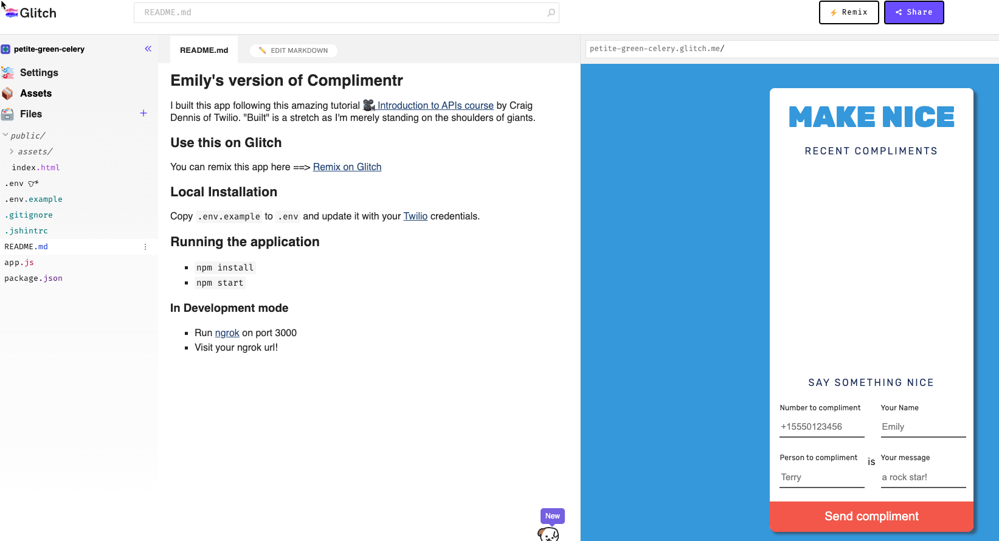
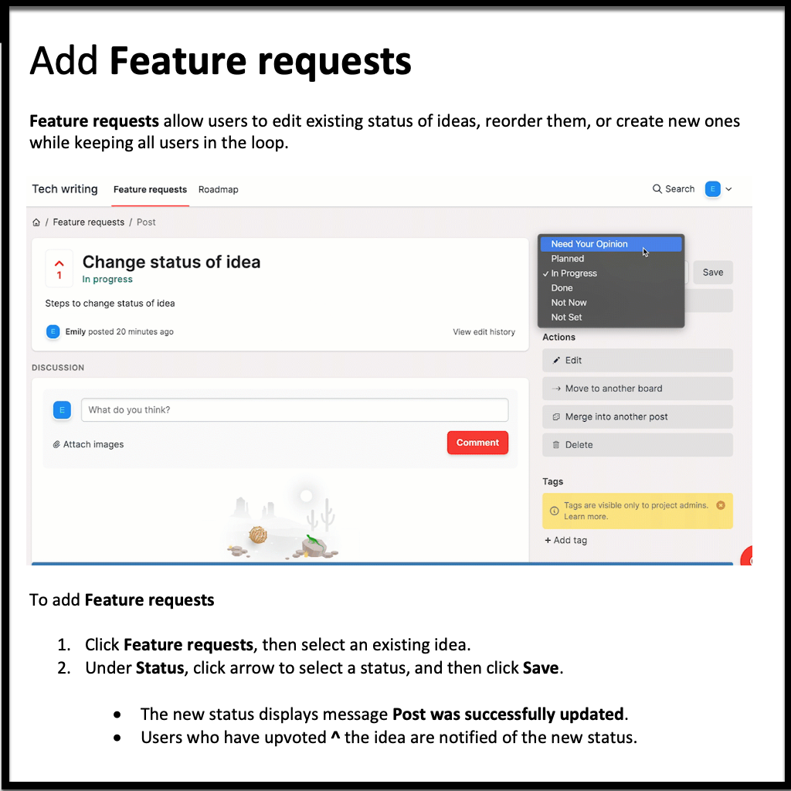
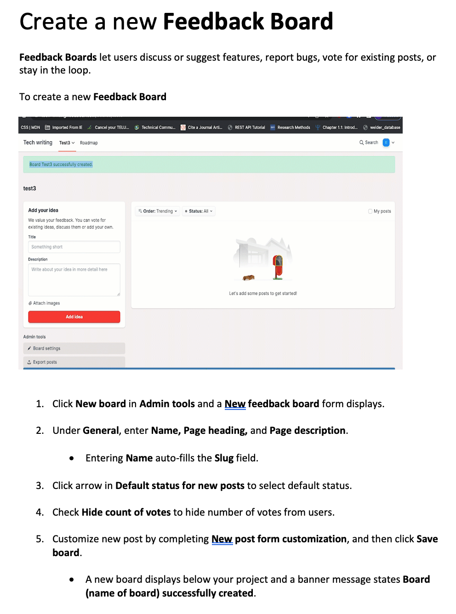
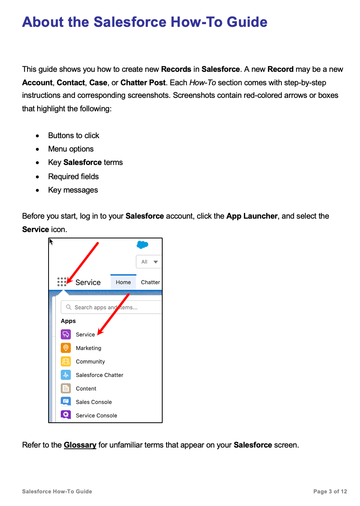
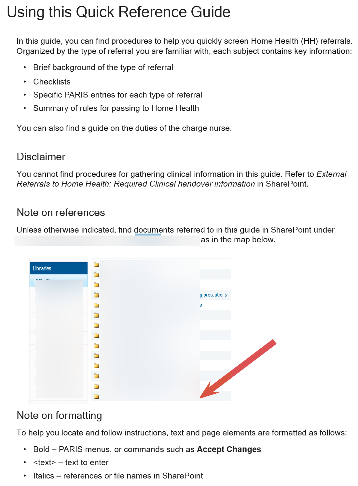
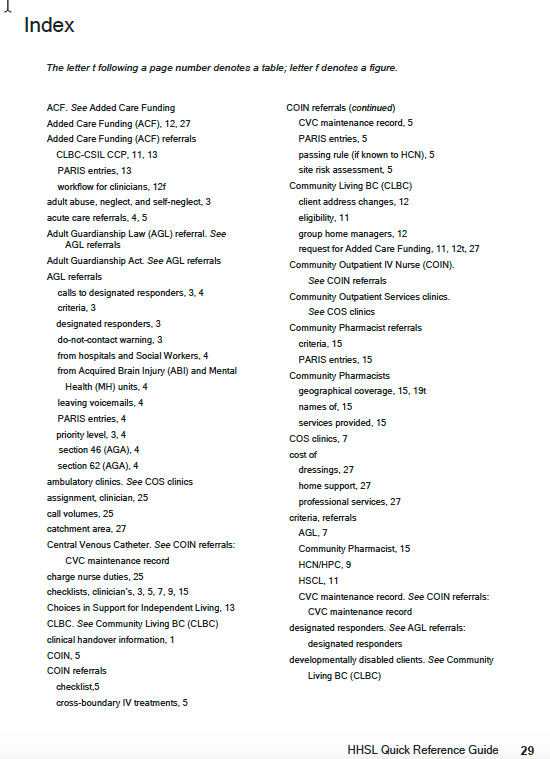
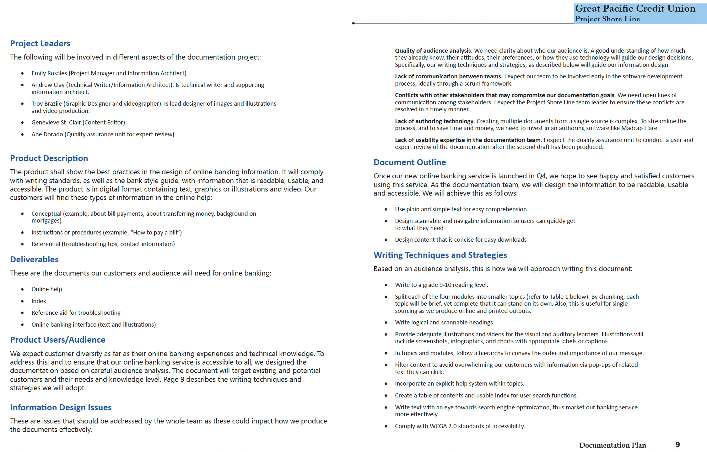
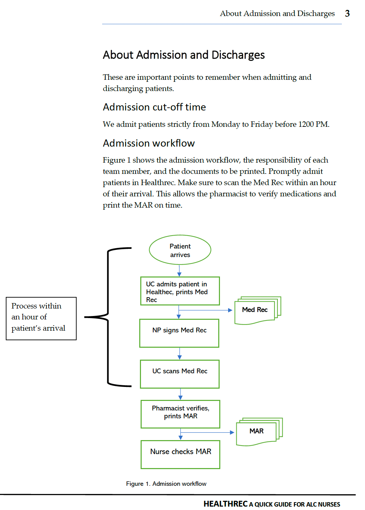
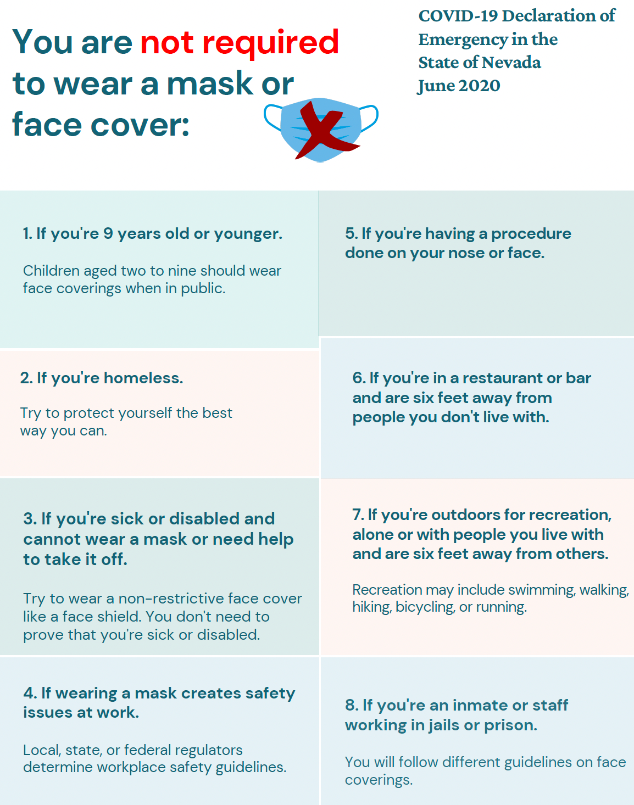

## Emily Rosales, technical writer/communicator

### Education
- Become a Technical Writer, Boot Camp (B. Kennedy)
- Simon Fraser University, Technical Communications certificate
- British Columbia Institute of Technology, Technical Writing
- University of the Philippines, AB Sociology

### Skills, Tools, Languages
- Microsoft Manual of Style, document development methodology
- HTML5/CSS, Markdown, YAML, JSON
- Visual Studio Code, Apache NetBeans
- REST API documentation, docs-as-code workflow
- Familiarity with Java, C, Python, and JavaScript
- git, GitHub, Confluence, Salesforce 
- Canva, Snagit, Madcap Flare, Adobe Acrobat, InDesign, Microsoft 365 products
- Health information systems (PARIS, MEDITECH, Strata Pathways)

### Licensed Practical Nurse, British Columbia College of Nurses and Midwives

## My Portfolio

### Transport for London Unified API

```
I wrote this overview of the TfL API as part of a Cherry Leaf API documentation course.
```

The Unified API provides real-time, high-volume, and accurate travel data across all transport modes within TfL and other transport authorities.
The API is now easier to use. Instead of providing different data formats for each transport mode, the API data is now uniform letting you: 
- Create once and maintain less.
- Automatically integrate API data into your databases.
- Keep your applications running and compatible even if source data changes.
The API is free and open to use in new ways if you follow the TfL data terms and conditions. 
We encourage you to use the Unified API instead of old data feeds. These feeds will be phased out once they are fully available in the Unified API.

### Use Cases
Using this API, you can:
- Compile accident details for a specified year.
- Get air quality data.
- Plan a journey across TfL using various transport lines and service types while getting real-time alerts about line or road disruptions, delays, and planned works.
- Calculate fares.
- Search bike points and occupancy, taxi and minicab information, and available facilities.
- Obtain real-time transport timetables and fixed bus schedules.
- Predict arrivals for all stops in each transport mode.
- Check availability of car and bike parking, and charge connectors.

### Base URL
All endpoints referenced below have the following base.
```
[https://api.tfl.gov.uk](mailto:https://api.tfl.gov.uk)
```
### Endpoints
The Unified API resources include the following:
- Accident Stats
- Air Quality
- Bike Points
- Occupancy
- Journey
- Line
- Place
- Stop Point
- Station Data
- Road
- Search
- Vehicle

### Getting an API key
Sign up for an Application ID and Key at [https://api-portal.tfl.gov.uk/signup](mailto:https://api-portal.tfl.gov.uk/signup). Add the app_id and app_key query parameters to your requests.

### API reference guide
Browse and try the endpoints using Swagger UI our build it yourself from this Swagger File.

### Rate Limits
You're allowed a maximum of 300 calls per minute per data feed. Then, we'll limit access to the API to prevent slowing down the overall service.
 

### Rest API documentation

Implemented a web app of people resources using Python, and created a REST API documentation in Swagger. This project is part of my self-directed studies.


### REST API messaging app

Implemented an existing web API that sends text messages using Twilio JavaScript and Python SDKs. App is deployed in Glitch. This project is part of my self-directed studies.

 
                                                        
### FeedBear instructions featuring Snagit

Wrote instructions to add feature requests in FeedBear. Original Word doc features Snagit video. This project is part of a technical writing boot camp.


     
Wrote instructions to post feedback in FeedBear. Original doc features Snagit video. This project is part of a technical writing boot camp.



### Salesforce instructions

Twelve-page instructions for new Salesforce users.



### Quick reference guide
     
Authored a 31-page guide for intake clinicians in a fast-paced call-center environment. It includes procedures, instruction, tables, and index. This is my final project to fulfill the requirements of my technical communications program at SFU.

#### This is the About page

     
#### This is a sample index page

     
### Project documentation plan

Authored a 12-page documentation plan to produce written content and deliverables for a fictitious bank. This project is also part of my technical communications program at SFU.



### User guide for nurses

Authored a 13-page guide for nurses and support staff admitting and discharging patients online.


            
### COVID-19 poster

Created a poster from existing Nevada State regulations. This is part of a Boot Camp in technical writing.

     
### Travel guide to Thailand

A useful travel guide when visiting Thailand. This is a group project in a technical writing class at BCIT.


### Design Project

Designed a 2-page VOIP sales brochure as part of my technical communications program at SFU.


     


[simplybiga@gmail.com](mailto:simplybiga@gmail.com)

##### Coquitlam BC, Canada
##### November 2022

<style>
  .purple {
    color:inherit;
  }
  .purple:hover {
    color:rgb(107,79,187);
  }
</style>
