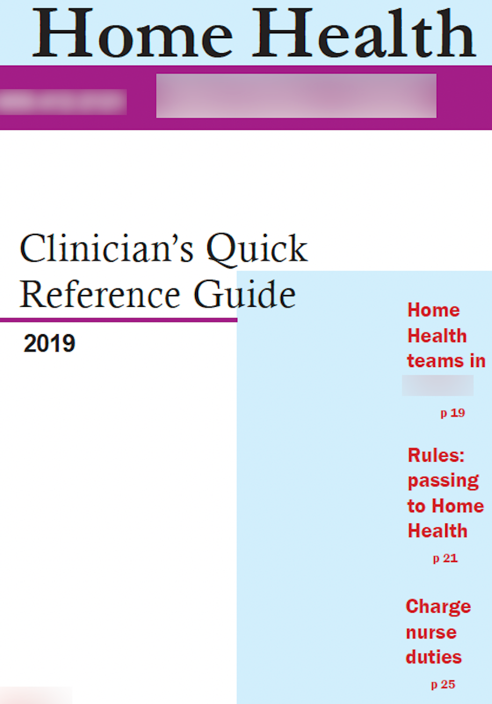

## My Portfolio

### This site is a work in progress.
{: .purple}

### REST API Documentation Project

### REST API messaging project
#### Used Twilio JavaScript SDK and rendered in Glitch.

 
                                                        
### FeedBear instructions featuring Snagit
#### First example

     
#### Second example     

     
- SalesForce/Confluence instructions
- User guide for access coordinators
- User guide for intake clinicians
- User guide for bedside nurses
- Writing project documentation

### Quick reference guidge
     
#### 31-page guide for clinicians that includes an index section.

     
### Sample index page

     
                                                        
### Design Project

#### VOIP sales brochure

     

[simplybiga@gmail.com](mailto:simplybiga@gmail.com)

##### Coquitlam BC, Canada
##### November 2022

