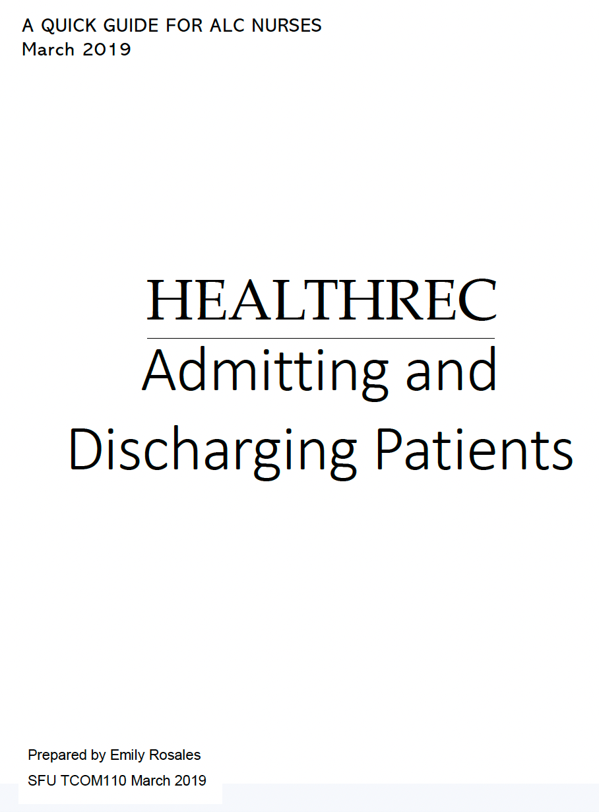

## My Portfolio - This site is still a work in progress.
{: .purple}

### REST API Documentation

Followed a Real Python tutorial to create an app of people and their notes. Using Python and a few other tools, created an API documentation in Swagger UI.

### REST API messaging app

##### Created a web API using a Twilio JavaScript helper library, Node.js and Flask. The app is rendered in Glitch. The app lets users send compliments to Twilio-validated phone numbers.

 
                                                        
### FeedBear instructions featuring Snagit
#### First example

     
#### Second example     

### Salesforce instructions
#### Twelves pages of step-by-step instructions for new users of Salesforce.

### Quick reference guide
     
#### 31-page guide for clinicians that includes an index section.

     
### Sample index page

### User guide for nurses

#### Cover page

#### About page

     
### Travel guide to Thailand

#### A group project in a technical writing class at BCIT.

     
                                                        
### Design Project

##### Using existing text, designed a VOIP sales brochure as part of my technical communications program at Simon Fraser University, BC.

     

[simplybiga@gmail.com](mailto:simplybiga@gmail.com)

##### Coquitlam BC, Canada
##### November 2022

