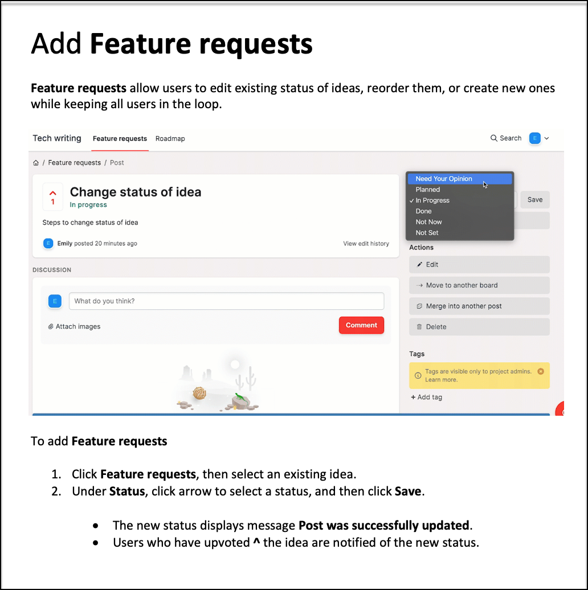

## Emily Rosales, technical writer/communicator

### Education
- Become a Technical Writer, Boot Camp (B. Kennedy)
- Simon Fraser University, Technical Communications certificate
- British Columbia Institute of Technology, Technical Writing
- University of the Philippines, AB Sociology

### Skills, Tools, Languages
- Microsoft manual of style, document development methodology
- HTML5/CSS, Markdown, YAML, JSON
- Visual Studio, NetBeans
- REST API documentation, docs-as-code workflow
- Familiarity with Java, C, Python, and JavaScript
- git, GitHub, Confluence, Salesforce 
- Canva, Snagit, Madcap Flare, Adobe Acrobat, InDesign

## My Portfolio

### Rest API documentation

Implemented a web app of people resources using Python, and created a REST API documentation in Swagger.

### REST API messaging app

Implemented an existing web API that sends text messages using Twilio JavaScript and Python SDKs. App is deployed in Glitch.

 
                                                        
### FeedBear instructions featuring Snagit

Example of instructions to add feature requests in FeedBear. Original Word doc features Snagit video.

     
Example of instructions to post feedback in FeedBear. Original doc features Snagit video.

### Salesforce instructions

Twelve-page instructions for new Salesforce users.

### Quick reference guide
     
A 31-page guide for intake clinicians. Guide includes an index section.

#### This is the About page

     
#### This is a sample index page

     
### Project documentation plan

A documentation plan for producing written content and deliverables for a fictitious bank that's implementing a new system regionally. This is part of my technical communications program at SFU.

### User guide for nurses

This is a quick guide for nurses and support staff admitting and discharging patients online.

            
### COVID-19 poster

Created a poster from existing Nevada State regulations. This is part of a Boot Camp in technical writing.

     
### Travel guide to Thailand

A useful travel guide when visiting Thailand. This is a group project in a technical writing class at BCIT.

### Design Project

Designed a 2-page VOIP sales brochure as part of my technical communications program at SFU.

     

[simplybiga@gmail.com](mailto:simplybiga@gmail.com)

##### Coquitlam BC, Canada
##### November 2022

